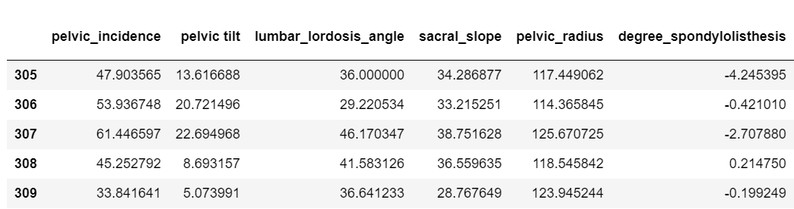

# Symptoms Checker using Machine Learning
The kind of back pain that follows heavy lifting or exercising too hard is often caused by muscle strain. But sometimes back pain can be related to a disc that bulges or ruptures.Identify possible conditions and predicts it is abnormal or normal.

This dataset is downloaded from Kaggle and the link is mentioned below: https://www.kaggle.com/sammy123/lower-back-pain-symptoms-dataset

The steps included in this analysis are:
```
1.Data Collection
2.Data Analysis
3.Data Visualization
4.Data Cleaning
5.Algorithm selection
6.Prediction
7.Saving the Model
```
### Importing Libraries
```
import pandas as pd
import seaborn as sb
from matplotlib.pyplot import scatter as sm
import matplotlib.pyplot as plt
from sklearn.linear_model import LogisticRegression
from sklearn.model_selection import train_test_split as tts
from sklearn.metrics import confusion_matrix
```

## Step 1: Data Collection

### Collecting the data into dataframe from the local machine
```
data = pd.read_excel('datas.xlsx')
```
## Step 2: Data Analysis

In this dataset, the target attribute is 'Class_att' , which shows the condition (normal/abnormal) based on the observations of different symptom. Hence, Its a classification problem as records need to be classified based on 0 or 1.

### Shows the number of rows and columns in the dataset (rows,columns).
```
data.shape

Output:
(310, 14)
```
### Check first 5(default) values in dataset
```
data.head()
```


### Check last 5(default) values in dataset
```
data.tail()
```



### Information about dataset
```
data.info()

Output:
<class 'pandas.core.frame.DataFrame'>
RangeIndex: 310 entries, 0 to 309
Data columns (total 14 columns):
 #   Column                    Non-Null Count  Dtype  
---  ------                    --------------  -----  
 0   pelvic_incidence          310 non-null    float64
 1   pelvic tilt               310 non-null    float64
 2   lumbar_lordosis_angle     310 non-null    float64
 3   sacral_slope              310 non-null    float64
 4   pelvic_radius             310 non-null    float64
 5   degree_spondylolisthesis  310 non-null    float64
 6   pelvic_slope              310 non-null    float64
 7   Direct_tilt               310 non-null    float64
 8   thoracic_slope            310 non-null    float64
 9   cervical_tilt             310 non-null    float64
 10  sacrum_angle              310 non-null    float64
 11  scoliosis_slope           310 non-null    float64
 12  Class_att                 310 non-null    object 
 13  Unnamed: 13               14 non-null     object 
dtypes: float64(12), object(2)
memory usage: 34.0+ KB
```
### Statistical information about dataset
```
data.describe()
```


### To get unique elements from a columns
```
data['Class_att'].unique()

Output:
array(['Abnormal', 'Normal'], dtype=object)
```
Two unique values ,normal and abnormal
### Replace 'object' categorical data with numerical by creating a dictionary for the values to be replaced
```
classes={'Normal':1,'Abnormal':0}

data.replace({'Class_att':classes},inplace=True)
```
Replace normal with 1 and abnormal with 0
## Step 3: Data Visualization
### To plot bar graph for prognosis
```
sb.countplot(data['Class_att'])
```

1 represents the patients with no back pain and 0 represents the patients with back pain. This dataset has more records of patients with back pain.
### To coount prognosis instances
```
data['Class_att'].value_counts()

Output:
Abnormal    210
Normal      100
Name: Class_att, dtype: int64
```
210 records of patients have back pain and 100 do not have as per the data set used.
### To show the correlation between 2 attributes
```
data.corr()
```


### Heatmap
```
plt.subplots(figsize=(20,15))
sb.set(font_scale=0.8)
x=sb.heatmap(data.corr(),annot=True,cmap='coolwarm')  #now it shows correlation between the attributes
plt.show()
```

Heat map is used to find the correlation betweeen attributes and the attributes that are less correlated to eachother and highly correlated to the target variable have to be kept for analysis. If the two attriubtes other than the target variable is kept for analysis, it decreases the accuracy of the model.
## Step 4: Data Cleaning
Drop a coloumn or remove null values to improve the accuracy.
```
data.drop('Unnamed: 13',axis='columns',inplace=True)
```
### Drop null values, if any
```
data.dropna(inplace=True)
```
## Step 5: Algorithm Selection
This is a classification problem as the target attribute has 2 type of instance which are 0 and 1 to indicate if a patient is diseased or not. So, the people have to be classified to these two groups.As this is a classification problem, I am using "Logistic Regression" algorithm.
### CREATE ARRAYS (x=features, y=target)
```
x=data.iloc[:,:-1].values 
y=data.iloc[:,-1].values 
```
### Find the random state and test size that gives highest accuracy
```
 for i in range(1,1000):
           print(i)
           x_train,x_test,y_train,y_test=tts(x,y,test_size=0.1,random_state=i)
           from sklearn.linear_model import LogisticRegression
           logreg=LogisticRegression()   #creating object
           logreg.fit(x_train,y_train)
           loregaccuracy=logreg.score(x_test,y_test)
           print(loregaccuracy*100)
 ```
 ```
Output:
1
87.09677419354838
2
87.09677419354838
3
80.64516129032258
4
83.87096774193549
5
90.32258064516128
6
87.09677419354838
7
90.32258064516128
8
87.09677419354838
9
87.09677419354838
10
90.32258064516128
11
93.54838709677419
12
87.09677419354838
13
96.7741935483871
14
87.09677419354838
15
87.09677419354838
16
80.64516129032258
17
74.19354838709677
```
From the above code, can be concluded that having test_size=0.1 and random_state=13 yields highest accuracy of 96.77%.Hence, I am using it. This helps in choosing optimal value for random_state
### Dividing values to training and testing set.
```
x_train,x_test,y_train,y_test=tts(x,y,test_size=0.1,random_state=13)
```
### Check size of train and test data
```
print(x_train.shape)

Output:
(279, 12)
print(x_test.shape)

Output:(31, 12)
print(y_train.shape)

Output:
(279,)
print(y_test.shape)

Output:
(31,)
```
### Creating Object
```
logreg=LogisticRegression()
```
### learning step (give data to model to learn)
```
logreg.fit(x_train,y_train)
LogisticRegression(C=1.0, class_weight=None, dual=False, fit_intercept=True,
                   intercept_scaling=1, l1_ratio=None, max_iter=100,
                   multi_class='auto', n_jobs=None, penalty='l2',
                   random_state=None, solver='lbfgs', tol=0.0001, verbose=0,
                   warm_start=False)
```
 ### Testing step (give new data and test algo efficienccy)
 ```
loregaccuracy=logreg.score(x_test,y_test)
loregaccuracy*100

Output:
96.7741935483871
```
## Step 6: Prediction
This model has accuracy of 96.77% in predicting the disease.
### To check predicted values
```
logregpred=logreg.predict(x_test)
logregpred 

Output:
array([1, 0, 0, 1, 1, 1, 0, 0, 1, 0, 1, 1, 0, 1, 0, 0, 0, 0, 0, 0, 0, 0,
       1, 0, 1, 1, 0, 0, 0, 1, 0], dtype=int64)
 ```
 ### compare right vs wrong predictions
 y_test has actual answer from 0 to 40 of different diseses and x_test has what it actually predicted 
Here its comparing those 2 to know how many matches and how many do not
```
conmat=confusion_matrix(y_test,logregpred)
conmat

Output:
array([[19,  1],
       [ 0, 11]], dtype=int64)
```
## Step 7: Saving the Model
To save the created model for future prediction
```
 file_name=open('LBP.pkl','wb') 
model_name=logreg
pickle.dump(model_name,file_name)
 ```
### Loading model
This model can be used again in future by importing, for analysing similar dataset without having to do all the above steps.
```
loaded_model=pickle.load(open('symptomIdentifier.pkl','rb'))
```
### Using loaded model
```
loaded_model.score(x_test,y_test)

Output:
0.967741935483871
```
